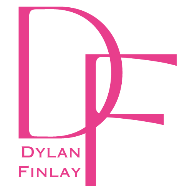

# Dylan Finlay Portfolio

Welcome to my portfolio website! This repository contains the source code for my [personal portfolio](https://dylanfinlay.com), where I showcase my projects, skills, and more.

## Table of Contents

- [About](#about)
- [Projects](#projects)
- [Skills](#skills)
- [Contact](#contact)

## About

This portfolio website was created as part of my journey in mechatronics engineering. It's built using React and Tailwind CSS, and it's focused on highlighting my projects, skills, and experiences.

## Projects

Here are some of the projects I've worked on:

- **The BarBot**: An autonomous drink delivery robot built using Lego EV3 Mindstorm hardware and programmed with RobotC. [GitHub](https://github.com/DylanFinlay/BarBot)

- **Web Scraping API**: A Python web scraper that grabs OG tags from websites and provides the data through a React web app. [GitHub](https://github.com/DylanFinlay/OpenGraph-Web-Scraper) | [Website](https://open-graph-web-scraper.vercel.app/)

- **Snack Track**: A React app to search and access detailed nutritional information about various foods. [GitHub](https://github.com/DylanFinlay/Snack-track) | [Website](https://snack-track.vercel.app/)

And more...

## Skills

Here are some of the skills I've developed:

- Mechatronics Engineering
- Software Development
- Web Development
- Python, JavaScript
- Robotics
- Problem Solving

## Contact

Feel free to reach out to me:

- LinkedIn: [Dylan Finlay](https://www.linkedin.com/in/dylanfinlay33/)
- GitHub: [DylanFinlay](https://github.com/DylanFinlay)
- Email: dylan.finlay33@gmail.com

Thank you for visiting my portfolio!
